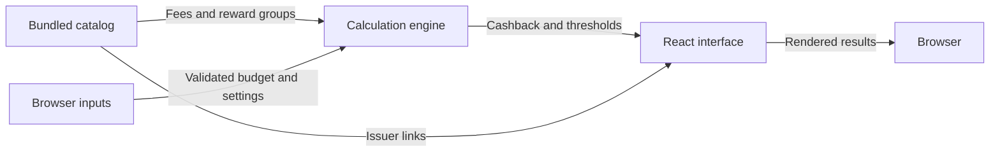

# Architecture

Cardback is a static React application with a pure reward engine. There is no backend, database, or public HTTP API.

## Data flow

The interface recalculates results when inputs change.



## Components

### Interface

`src/App.tsx` owns selected cards, independent configurations, budget strings, mode, and period. It validates inputs and formats CAD values. `src/styles.css` supplies application styling.

### Data and engine

`src/catalog.ts` defines thirty-two budget categories and assembles thirty-two card entries, including the additional issuers in `src/retail-catalog.ts`. `src/types.ts` defines cards, reward groups, budgets, and settings. `src/engine.js` uses checked JSDoc and exports calculation functions tested without React rendering. See [Card catalog](./card-catalog.md) for coverage and issuer sources.

### Assets and docs

Local artwork lives in `public/cards/` with source URLs recorded in a manifest. The UI provides descriptive alternative text and a text fallback on image failure.

MkDocs inherits a shared Material theme. CI builds the app first, adds docs in `dist/docs/`, and publishes one artifact.

## Repository layout

```text
src/                        Interface, catalog, engine, types, tests
public/cards/               Bundled issuer artwork
scripts/card-images.mjs     Artwork download and validation
scripts/check-build.mjs     Application production checks
scripts/docs.mjs            Shared documentation staging
docs/                       Documentation source
mkdocs.yml                  Docs identity and navigation
.github/workflows/          CI, tests, docs lint, Pages deployment
```
