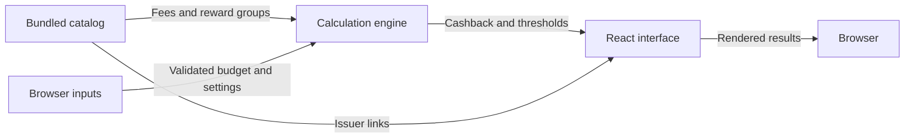

# Architecture

Cardback is a static React application with a pure reward engine. There is no backend, database, or public HTTP API.

## Overview

The interface recalculates results when inputs change. Bundled fees and rates are passed to the engine alongside browser state.



## Components

### Interface

`src/App.tsx` owns selected cards, independent configurations, budget strings, mode, and period. It validates inputs and formats CAD values. `src/styles.css` supplies application styling.

### Data and engine

`src/catalog.ts` defines thirty-two budget categories and assembles thirty-two card entries, including the additional issuers in `src/retail-catalog.ts`. `src/types.ts` defines cards, reward groups, budgets, and settings. `src/engine.js` uses checked JSDoc and exports calculation functions tested without React rendering. See [Card catalog](./card-catalog.md) for coverage and issuer sources.

### Assets and docs

Local artwork lives in `public/cards/` with source URLs recorded in a manifest. The UI provides descriptive alternative text and a text fallback on image failure.

MkDocs inherits a shared Material theme. CI builds the app first, adds docs in `dist/docs/`, and publishes one artifact.

## Data flow

1. `src/main.tsx` mounts React and imports the application styles.
2. `src/catalog.ts` assembles the primary and retail catalogs, student variants, portal groups, and explicit EV eligibility.
3. `src/App.tsx` validates budget strings and constructs numeric monthly spending. Card selections and configuration objects remain independent.
4. The engine returns annual reward values and unrounded threshold crossings. React formats money and rounds displayed thresholds upward.
5. Card images are loaded from the Vite base plus `cards/`; failed loads show a text fallback.

For example, the default groceries-only calculation passes the BMO World Elite card and a grocery spending weight to `breakEven`. Its $139 annual fee and 5% rate produce $2,780 annually, displayed as $231.67 monthly. See [Engine reference](./engine-reference.md) for exports and return values.

## Directory layout

```text
src/                        Interface, catalog, engine, types, tests
public/cards/               Bundled issuer artwork
scripts/card-images.mjs     Artwork download and validation
scripts/check-build.mjs     Application production checks
scripts/docs.mjs            Shared documentation staging
docs/                       Documentation source
mkdocs.yml                  Docs identity and navigation
.github/workflows/          CI, tests, docs lint, Pages deployment
```

## Design decisions

The JavaScript engine uses TypeScript-checked JSDoc so Node.js tests can import it directly while the React app uses the shared TypeScript types. Catalog changes stay separate from calculation logic. `src/card-artwork.json` provides one filename mapping for the UI, download script, tests, and production checker.

The app and docs are built separately and combined into one Pages artifact. The existing workflow builds Vite before MkDocs and deploys the validated artifact after tests pass. See [Deployment](./deployment.md).
