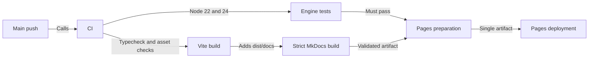

# CI/CD

GitHub Actions validates the calculator and docs before publishing both in one Pages artifact.

## Workflow sequence

Main pushes deploy only after checks succeed.



## Workflow responsibilities

| File | Triggers | Responsibility |
| --- | --- | --- |
| `ci.yml` | Non-main pushes, main-targeted PRs, reusable calls, manual | Tests, app checks, strict docs build, production artifact. |
| `tests.yml` | Reusable calls, manual | Vitest on Node 22 and 24; JUnit reports. |
| `pages.yml` | Main pushes, manual on main | Calls CI, uploads and deploys its validated artifact. |
| `docs-lint.yml` | Docs-related PRs, manual | Shared Markdown lint, strict build, and external links; no deployment. |

Vite cleans `dist/`, so it must build before MkDocs writes `dist/docs/`. Keep one Pages deployment owner: separate deployments replace each other's files.

## Published paths

The [calculator](https://williamvdg.me/cardback/) stays at the project root and [docs](https://williamvdg.me/cardback/docs/) live beneath it.

Pages uses GitHub Actions. Deployment needs `pages: write` and `id-token: write`; no personal token is required. Artifacts and reports are retained seven days, and deployments are serialized without cancellation.

The shared docs configuration and lint caller are pinned to one commit. The reusable workflow controls its own action versions and dependency requirements.

## Reproduce deployment output

After [installing docs dependencies](./installation.md):

```sh
npm test
npm run build
npm run check:build
npm run docs:build -- --site-dir dist/docs
npm run preview
```

Check `/cardback/` and `/cardback/docs/` on the preview server. Push to `main` to deploy; local builds do not publish.
